# Módulo de Servidores - Memoria Técnica

## Consideraciones previas

Para la realización de esta práctica he utilizado un sistema operativo Debian GNU/Linux versión 10.

## Instalación del servidor SSH y APACHE 2

1. Para permitir conexión remota al terminal habilitamos un servidor SSH. Lo instalaremos desde los repositorios de paquetes oficiales de Debian con el comando:

  `sudo apt-get install openssh-server`

  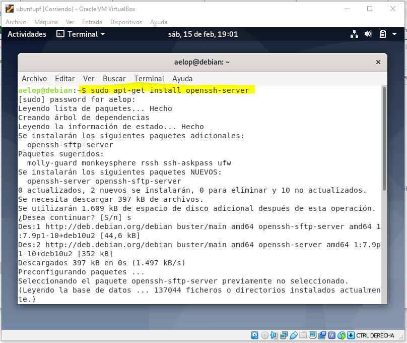

2. Una vez instalado el servidor de SSH pasaremos a establecer una conexión remota. En este caso con una máquina Windows y el cliente SSH PuTTY.

  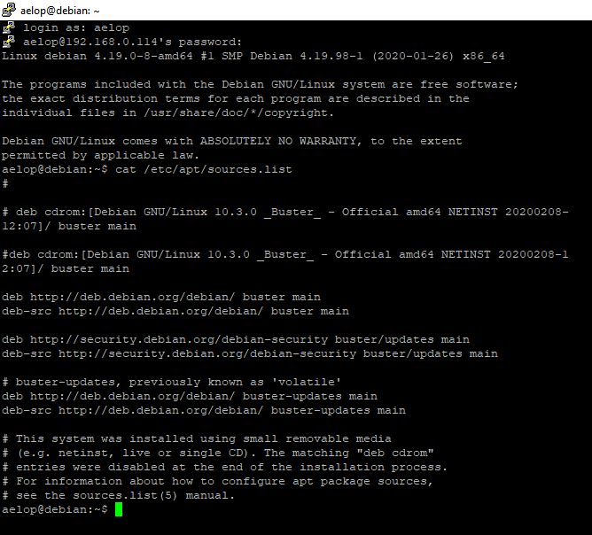

  Conectamos con el usuario __aelop__ a la IP __192.168.0.114__ de la red local. Aprovechamos para comprobar qué repositorios de paquetes están disponibles en el sistema para saber si podremos instalar Apache 2 en el siguiente paso. Para ello sacamos el contenido del fichero _/etc/apt/sources.list_ por salida estándar:

  `cat /etc/apt/sources.list`

3. A continuación instalamos el servidor web Apache 2:

  `sudo apt-get install apache2`

  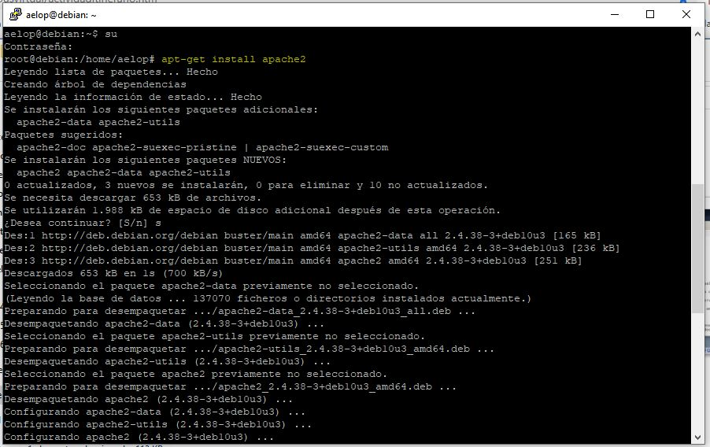

  Para verificar que el software se ha instalado correctamente levantaremos el servicio con el comando:

  `sudo systemctl apache2 start`

  Una vez arrancado debería de ser accesible la página de bienvenida de Apache 2 done se muestra un texto que pone __IT WORKS!__. Podemos verla entrando desde cualquier navegador al puerto 80 de la máquina.

  - `http://localhost`
  - `http://127.0.0.1`
  - `http://192.168.0.114` _(Desde una máquina remota)_

## Creación de los VirtualHosts

1. Creamos una carpeta donde se alojará el contenido de los distintos sitios virtuales que configuraremos. Para ello usamos permisos de administrador.

  `sudo mkdir /home/webs`

  En la captura puede verse el resultado:

  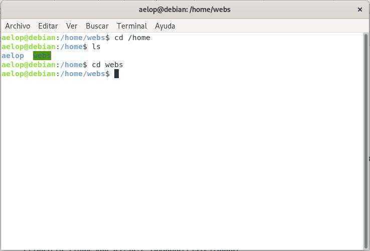

### VirtualHost: www.miweb.com

1. Como ya hemos dicho, los distintos sitios estarán alojados dentro de la carpeta _/home/webs_, por lo tanto crearemos un subdirectorio llamado __/miweb__.

  `sudo mkdir /home/webs/miweb`

2. Dentro de esta carpeta creamos un fichero __index.html__ que será la página de inicio del sitio.

  `echo '<html><body><h1>Hola mundo</h1><p>P&aacute;gina de inicio de miweb</body></html>' >> index.html`

  Puede verse en la siguiente captura:

  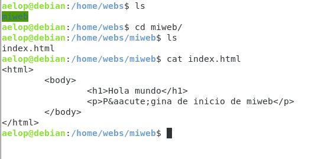

3. A continuación vamos a configurar un VirtualHost nuevo. Aquí hay que distinguir dos carpetas importantes a nivel de configuración de Apache:

  - __/etc/apache2/sites-availables__: Contiene los ficheros de configuración (_.conf_) de los distintos sitios virtuales disponibles para el servidor.
  - __/etc/apache2/sites-enabled__: Aquí debe existir un enlace simbólico al fichero _.conf_ de cada uno de los sitios virtuales que queramos tener habilitados.


  Crearemos el fichero de configuración __miweb.conf__ en la carpeta _/sites-availables_ y añadiremos las directivas necesarias:

  `sudo nano miweb.conf`

  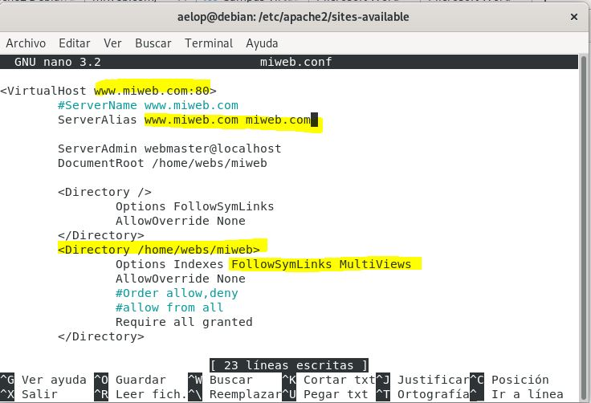

  Algunas consideraciones:

  - En la primera línea resaltada de amarillo se define el hostname del sitio y el puerto de conexión: _www.miweb.com:80_
  - Además, también queremos que se resuelva la dirección escribiendo _miweb.com_. Así pues, definimos un ServerAlias: _miweb.com_
  - En la tercera línea resaltada en amarillo estamos definiendo la ruta donde se aloja el contenido del sitio, en nuestro caso _/home/webs/miweb_. Aprovechamos para permitir seguir enlaces simbólicos y multiviews: _FollowSymLinks Multiviews_.
  - La directiva _Require all granted_ da acceso público a todos los recursos del directorio.


4. El siguiente paso es habilitar como página de inicio el __index.html__. Esto se consigue a través del módulo __mod\_dir__.

  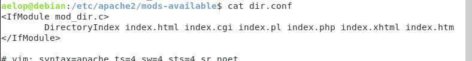

5. Para habilitar el host que acabamos de configurar hay dos opciones. Por un lado, como comentamos previamente, se puede crear un enlace simbólico a _miweb.conf_ en la carpeta _/sites-enabled_:

  `cd /etc/apache2/sites-enabled && sudo ln -s miweb.conf ../sites-availables/miweb.conf`

  De manera alternativa, también puede hacerse uso del script __a2ensite__ para habilitarlo (__a2dissite__ para deshabilitar):

  `sudo a2ensite miweb`

6. Para terminar, es necesario reiniciar el servidor Apache con el siguiente comando:

  `sudo systemctl apache2 restart`

7. Como las pruebas las estamos realizando en un entorno de pruebas local los nombres de dominio no van a resolverse, ya que no están propagados en ningún servidor DNS todavía. Para simular esto, añadiremos la siguiente línea al fichero _/etc/hosts_ local:

  `127.0.0.1    www.miweb.com miweb.com`

8. Verificamos que todo funciona correctamente accediendo al sitio web desde el navegador:

  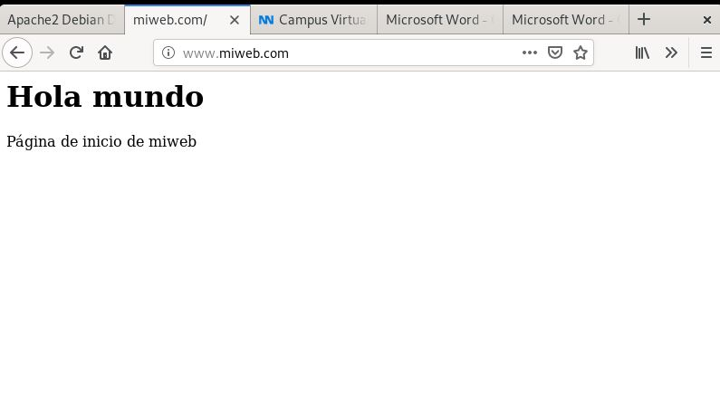

### VirtualHost: www.accesobasico.com

1. El contenido de este sitio se alojará en una nueva carpeta dentro de _/home/webs_ llamada __/accesobasico__. A su vez tendremos un subdirectorio con recursos de acceso privado al que llamaremos __/privado__.

  `sudo mkdir -p /home/webs/accesobasico/privado`

2. A continuación configuramos el VirtualHost en un fichero __accesobasico.conf__ del mismo modo que www.miweb.com, con la salvedad de que aquí es necesario incluir una directiva <Directory> para definir el nivel de seguridad del directorio __/home/webs/accesobasico/privado__.

  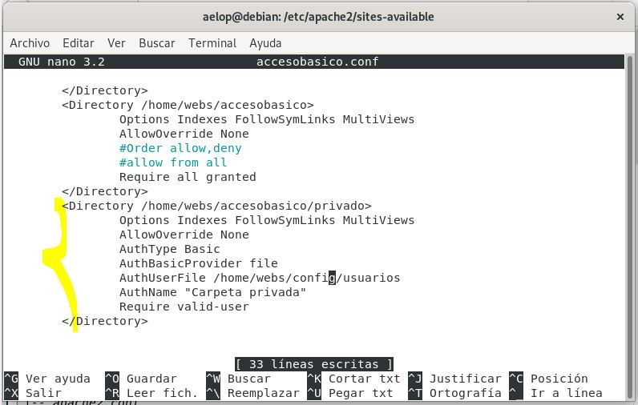

  En la captura anterior está marcado en amarillo el fragmento donde se define el tipo de autenticación necesaria para acceder al recurso privado. Esta consiste en un login básico de usuario/contraseña. La información de usuarios se encuentra en un fichero al que hemos llamado __usuarios__. Existe una utilidad para generar este tipo de ficheros, y se utiliza del siguiente modo:

  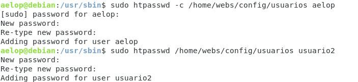

  Aquí hemos generado dos usuarios, _aelop_ y _usuario2_.

3. Ya solo quedaría habilitar el nuevo sitio con __a2ensite__, reiniciar el servidor y añadir el hostname __www.accesobasico.com__ al fichero _/etc/hosts_. Una vez hecho esto, podemos comprobar que para acceder al recurso privado nos pide identificación de usuario:

  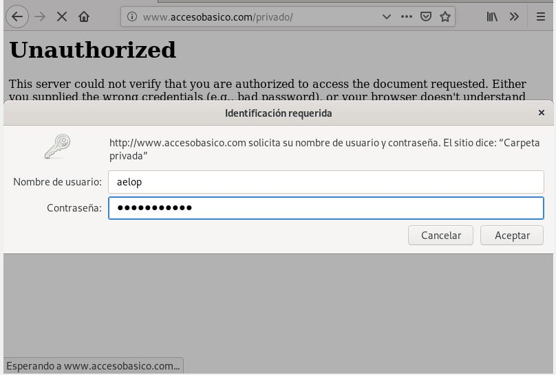

  Ahí va eso fiera, titán, mastodonte, tiburón!!

### VirtualHost: www.missl.com

Para el tercer ejercicio vamos a configurar un sitio web con cifrado SSL. Esto quiere decir que configuraremos el VirtualHost para que sea accesible tanto por el puerto __80 (http)__ como por el __443 (https)__.

1. Antes de nada hay que verificar que tenemos instalado los _wrappers_ de soporte para SSL en Debian. En nuestro caso estaban ya instalados:

  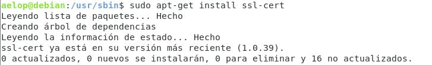

2. Seguidamente lo que haremos será generar el certificado RSA que identificará al servidor. Para ello utilizaremos las herramientas de OpenSSL:

  `openssl genrsa -out server.key 2048`

  Este comando genera una clave privada RSA de 2048 bits cifrada con triple DES (PKCS#12) y la guarda en un fichero llamado _server.key_

  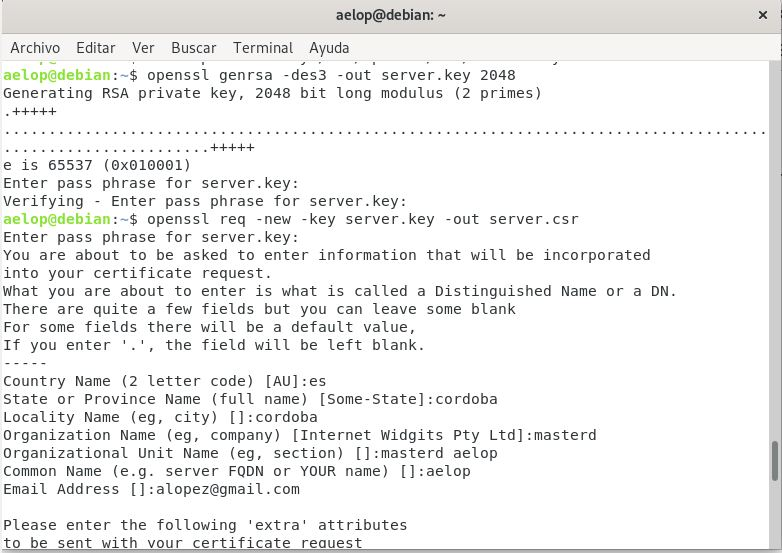

3. También generamos el certificado o clave pública a partir de la clave privada y lo guardamos en un fichero llamado _server.crt_:

  `openssl req -x509 -days 365 -key server.key -out server.crt`

  - Con la opción _-x509_ pedimos que el certificado sea autofirmado y nos saltamos el paso de generar una solicitud de certificación (ficheros _\*.csr_). Los navegadores mostrarán una alerta de seguridad cuando accedamos al sitio debido a que no ha sido validado por ninguna Entidad de Certificación.
  - _-days 365_ indica el período de validez del certificado.
  - _-key server.key_ indica el fichero con la clave privada
  - _-out server.crt_ indica el fichero de salida donde se guardará el certificado.

  Es posible abreviar el paso 2 y 3 en un mismo comando:

  `openssl req -x509 -days 365 -newkey rsa:2048 -keyout server.key -out server.crt`

4. Ahora configuramos el sitio virtual como hemos hecho en ejercicios anteriores. Así pues, creamos un nuevo directorio en _/home/webs/missl_ y el archivo __missl.conf__ en el servidor Apache. Éste tendrá dos directivas VirtualHost, una para el puerto 80 y otra para el 443. Primero vamos a ver la del __puerto 443__:

  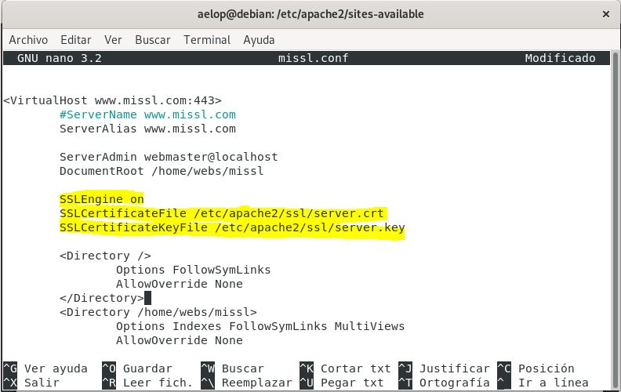

  Como se puede observar, estamos configurando un VirutalHost en el puerto 443 para el hostname _www.missl.com_. El cifrado SSL se habilita mediante la directiva __SSLEngine On__, indicándole las rutas al certificado y la clave del servidor. Ambos ficheros deben encontrarse en la ruta __/etc/apache2/ssl__.

  - /etc/apache2/ssl/server.key
  - /etc/apache2/ssl/server.crt


5. Por otro lado, dentro del mismo archivo _missl.conf_ configuraremos otro VirtualHost para trabajar con las conexiones del puerto 80. Como queremos que todos los usuarios que accedan a la dirección _www.missl.com_ pasen a través de conexión segura necesitamos redirigir las peticiones enviadas al puerto 80 hacia el puerto 443. Para ello incluiremos la directiva __Redirect__ al final de éste VirtualHost:

  ```
  <VirtualHost www.missl.com:80>
    [...]
    Redirect / https://www.missl.com
  </VirtualHost>
  <VirtualHost www.missl.com:443>
    [...]
  </VirtualHost>
  ```

6. La redirección es una capacidad de Apache que puede habilitarse o deshabilitarse a través del módulo __mod_alias__. Para que funcione deberemos activarlo con el comando:

  `sudo a2enmod alias`

  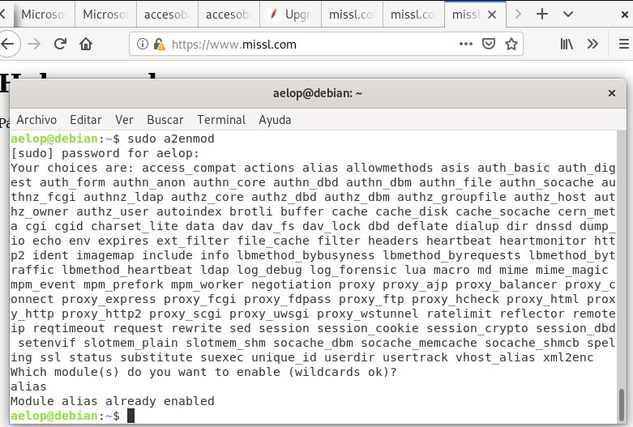

7. A su vez, el cifrado SSL en Apache también depende de un módulo. Concretamente __mod_ssl__. Nos aseguramos de que también esté habilitado:

 `sudo a2enmod ssl`

8. Para terminar añadimos _www.missl.com_ al fichero _/etc/hosts_ y reiniciamos el servidor Apache.

 `127.0.0.1   www.miweb.com miweb.com www.accesobasico.com www.missl.com`

 `sudo systemctl apache2 restart`
